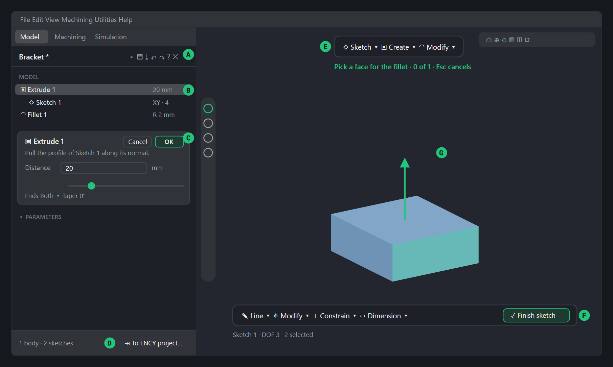
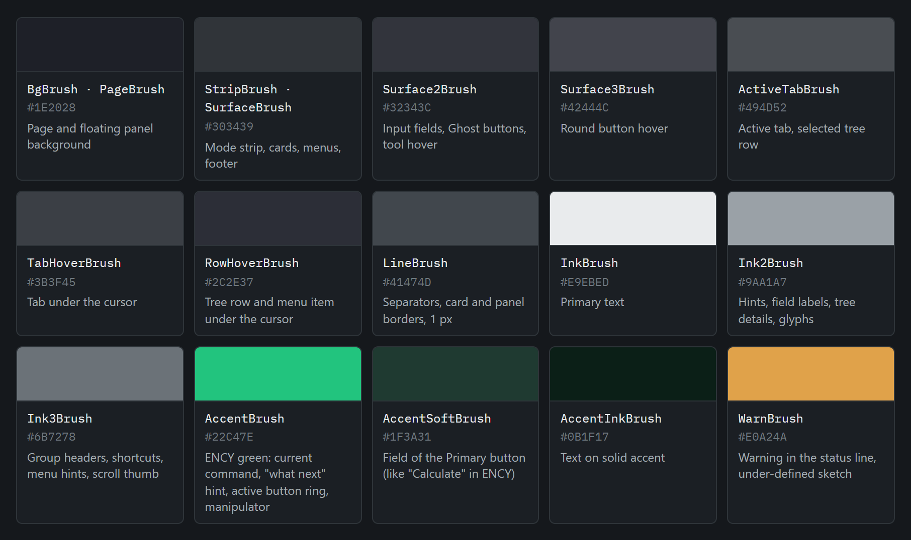
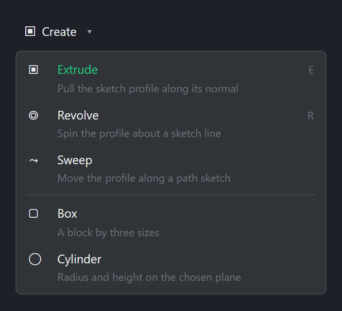
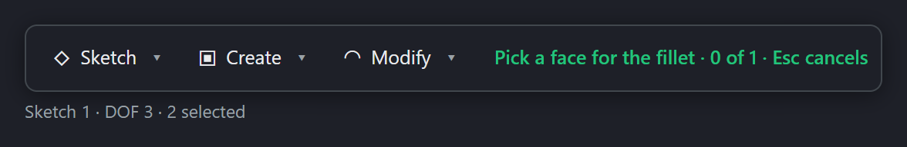
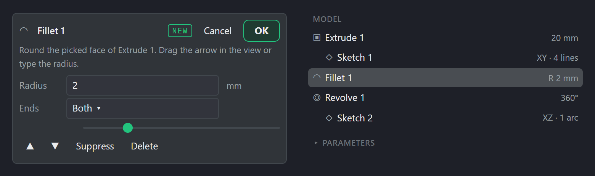

# Design Rules for ENCY Extensions

How an extension that lives inside ENCY 3 should look and behave: panels, commands, colours, words, behaviour across the modes.

The rules are for any extension that shows its own UI inside ENCY — a page over an ENCY panel, command panels over the 3D view, objects in the scene. An extension that only opens an inspector dialog needs few of them: ENCY draws that dialog itself ([UI patterns, pattern 1](ui-patterns.md#pattern-1-inspector-dialog-recommended-for-parameter-input)).

This page says **what** the result should be. **How** to build it: [UI patterns](ui-patterns.md) (threads and windows), [Theming plugin windows](theming-plugin-windows.md) (the host palette), [UI § Custom 3D rendering](../api/ui.md#custom-3d-rendering) (objects in the scene).

> Adapted for all extension authors from version 1.0 (8 September 2026). The rules grew out of building the ENCY Pilot instruments (September 2026), from remarks made while actually working in the program. The technical notes assume WPF on .NET 10.

---

## 1. Ten rules

The numbers exist so a rule can be named in a discussion ("by rule 3"). Under each rule is the remark it grew from, translated from the Russian review notes.

### Rule 1. A native part of ENCY, not a separate program

The extension has no main window of its own. Its page lives over an ENCY panel, its command panels over the 3D view. It takes ENCY's theme (dark and light) live, its font, its corner radii and spacing. No Windows frames, no window titles, no taskbar icons.

> *Source:* "It must be a native part of ENCY, not a separate window." "I see the very same panel": the page has to cover the ENCY panel exactly.

### Rule 2. The minimum on screen

One button per group of commands; the commands themselves in a drop-down list, like the operation list in ENCY: glyph, name, a one-line hint, a shortcut. The current command is marked in the accent colour. No panels with rows of buttons, no full-width buttons.

> *Source:* "The panels are too big, panels full of buttons, not user-friendly. A drop-down list of commands, the way operations are done in ENCY. The Add the model button is too big."

### Rule 3. The left side holds only the tree and the properties

The page in the ENCY panel contains the model tree (the history) and the properties card of the selected element. Every command sits in floating panels in the middle of the graphics area. 2D and 3D are separate panels: the top one for bodies, the bottom one for the sketch, and the bottom one is visible only while a sketch is open.

> *Source:* "The tab on the left must hold only the 3D model tree and element properties; all commands go into separate panels in the centre of the graphics area." "2D and 3D commands must be in different panels."

### Rule 4. Every command gets its own card and its own history row

Each design and edit operation has its own fields, its own row in the tree (glyph, name, details) and its own OK / Cancel. One window "for everything" is not acceptable. The main parameter is duplicated by a slider in the card and a manipulator in 3D.

> *Source:* "Design and edit commands must each have their own properties and their own history in the tree. Is it one window for everything now?"

### Rule 5. Direct modelling in every 3D command

Any 3D command accepts a pick in the 3D view: a face, an edge, a body. The face under the cursor lights up, the picked one takes the pick colour, the panel shows a "what to pick" hint with a counter. The main parameter is dragged with a manipulator (an arrow along its direction); faces support press/pull.

> *Source:* "For Fillet I must be able to pick the face of the model. This principle applies to all commands." "Why doesn't a face light up when the mouse hovers over it?"

### Rule 6. The next step is obvious

A "what next" hint in the accent colour is always on screen, together with an explicit button that ends the step: Finish sketch, OK. Empty entities are never created: a sketch with no geometry is dropped on exit, the tree holds no phantoms.

> *Source:* "It is unclear how to finish one 3D operation and start the next." "Why are there two sketches in the left panel when I create only one, and it is not obvious how to move to the next operation."

### Rule 7. An outward action only with confirmation

Handing the result to the ENCY project, exporting, writing files: a button with an ellipsis, then a summary (what, how many, where, in which format), a confirmation, a message with the result. Once, explicitly, before the action.

> *Source:* "It is unclear how to hand the built 3D model to ENCY. There must be a confirmation button, and before the transfer, an obvious one."

### Rule 8. The data format is part of the design

What goes into the CAM project is a solid (STEP AP214 with a closed shell), never a mesh. STL is a fallback only, and it is labelled as such. The format is chosen in the summary before the transfer.

> *Source:* "STL is an unsuitable format for working with 3D geometry in CAM." "Solid geometry must be created, not a shell."

### Rule 9. An extension lives in its own mode

It appears only in the ENCY mode it belongs to (Model, Machining or Simulation), disappears when the mode changes and comes back by itself. It has a visible ✕ button: on closing it removes its windows and its scene objects and restores what was underneath.

> *Source:* "[The extension] hangs on every tab, while it should be on Model only and disappear when switching." "It is unclear how to close this function. It covers the ones that were there before."

### Rule 10. No flicker, no freezes

The scene updates without an empty frame: the new is built before the old is removed. While dragging, drawing is simplified; the full drawing returns after 1.5 s of rest. Nothing heavy on the ENCY message thread, state is read asynchronously. Navigation is native: the wheel and panning go to ENCY, and the extension's layers follow the camera, so the grid never drifts under the geometry.

> *Source:* "On zoom the grid under the element moves, not the element itself." "Everything froze when I tried to move the scene." "Flicker while pulling Extrude, that must not happen."

---

## 2. Layout

An extension occupies three zones of the ENCY window — the ENCY panel, floating panels over the 3D view, and the 3D view itself — and nothing beyond them. Whatever ENCY draws itself (the menu, the mode strip, the visibility column, the toolbar over the view) stays in place and is never covered.

*The ENCY 3 window in Model mode with a modelling extension open. Dark theme, schematic scale.*

- **A** — Page header: document name, New / Open / Save, undo and redo, help, ✕ close.
- **B** — Model tree: the operation history, each row with a glyph, a name and details on the right.
- **C** — Properties card of the selected operation: Cancel / OK in the header, a hint, fields, a slider for the main parameter.
- **D** — Footer: the summary on the left, the confirmed action on the right ("To ENCY project…").
- **E** — Top floating panel: 3D commands as drop-down lists, the "what next" hint underneath.
- **F** — Bottom floating panel: sketch tools and "Finish sketch". Visible only while a sketch is open.
- **G** — Direct modelling in the view: the face under the cursor lit, the manipulator of the main parameter.

### Sizes

| Element | Size, DIP | Placement and behaviour |
|---|---|---|
| Page in the ENCY panel | panel width (≈400) × panel height | Covers the ENCY panel under the mode strip edge to edge; follows the window when it moves or resizes (polled every 300 ms). |
| Top command panel | ≈290, ≈470 in a sketch; height 34 | Centred over the 3D view, 12 from the top. Width from content, never fixed. |
| Bottom sketch panel | up to 900; height 34 + status line | Centred over the 3D view, 16 from the bottom. Appears with the sketch, leaves with it. |
| Properties card | page width − 20; columns 58 / * / 50 / 22 | Columns: label, value, units or computed value, remove button. |
| ENCY's own panels (measured at 150 %) | radii: panels 13 px, toolbar 14, visibility column 28 | The extension's windows never argue with them: the page has radius 0 (it sits inside the panel), floating panels 8, cards 6, buttons 6–7, menus 5–6. |

---

## 3. Colour

The palette was measured on the ENCY 3 mode strip (dark theme "Outer Space"). These are the defaults: at run time the extension reads the ENCY theme every 2 s and swaps its brushes, so every colour reference in XAML must be a `DynamicResource`, never a `StaticResource`.

| Brush | Hex | Use |
|---|---|---|
| `BgBrush` · `PageBrush` | `#1E2028` | Page and floating panel background |
| `StripBrush` · `SurfaceBrush` | `#303439` | Mode strip, cards, menus, footer |
| `Surface2Brush` | `#32343C` | Input fields, Ghost buttons, tool hover |
| `Surface3Brush` | `#42444C` | Round button hover |
| `ActiveTabBrush` | `#494D52` | Active tab, selected tree row |
| `TabHoverBrush` | `#3B3F45` | Tab under the cursor |
| `RowHoverBrush` | `#2C2E37` | Tree row and menu item under the cursor |
| `LineBrush` | `#41474D` | Separators, card and panel borders, 1 px |
| `InkBrush` | `#E9EBED` | Primary text |
| `Ink2Brush` | `#9AA1A7` | Hints, field labels, tree details, glyphs |
| `Ink3Brush` | `#6B7278` | Group headers, shortcuts, menu hints, scroll thumb |
| `AccentBrush` | `#22C47E` | ENCY green: current command, "what next" hint, active button ring, manipulator |
| `AccentSoftBrush` | `#1F3A31` | Field of the Primary button (like "Calculate" in ENCY) |
| `AccentInkBrush` | `#0B1F17` | Text on solid accent |
| `WarnBrush` | `#E0A24A` | Warning in the status line, under-defined sketch |

### Scene colours

| Object in the 3D view | Colour | Rule |
|---|---|---|
| Body drawn by the extension | `#8CB4D8` | A calm blue, distinct from the project geometry of ENCY and from the stock. |
| Picked face | `#2ED8A8` | Drawn as its own object: a copy of the face lifted ~1.6·ε above the body. |
| Face under the cursor | `#6EE6C8` | Lighter than the pick colour, lifted ~1·ε; gone the moment the cursor leaves the face. |
| Manipulator | `#22C47E` | An arrow along the main parameter; the only accent in the scene. |

### One accent at a time

The accent is spent on one thing at a time: the current command, the "what next" hint, the primary action button or the manipulator. If more than two accent elements are on screen, one of them is surplus.

---

## 4. Type and icons

### Scale

| Role | Size | Weight and colour |
|---|---|---|
| Body text of the windows | 12.5 | Segoe UI Regular, Ink |
| Section heading (H1) | 14 | SemiBold, Ink |
| Document name in the header | 13 | SemiBold, Ink |
| Primary button | 13 | Regular, Ink on AccentSoft |
| Hint | 11.5 | Regular, Ink2, wrapping |
| Menu hint and shortcut | 11 | Regular, Ink3 |
| Group header | 10.5 | SemiBold, Ink3, UPPERCASE |
| Glyph in a menu or card | 14 | Segoe UI Symbol |
| Glyph on a tool button | 17 | Segoe UI Symbol |

The typeface is always Segoe UI: it is ENCY's own. There is no second family in the interface. Numbers in fields and in tree details are right-aligned with their units (mm, °).

### Icons

- A 24 × 24 frame, a 2.2 stroke with round caps.
- Two-tone: the main shape in the text colour (Ink), one detail in the accent. Example: the toolpath wave white, the play mark green. From the review notes: "the icons must be white and green".
- Menus and the tree use Segoe UI Symbol glyphs instead of icons: ◇ sketch, ▣ extrude, ◠ fillet, ⌖ modify, ⇥ transfer. One glyph per type, the same in the tree, the menu and the card.
- Tooltips after 400 ms, one sentence: what it does and where it acts.
- No emoji-style icons, no coloured bitmap icons.

---

## 5. Components

The specimens below use the values on this page. Name your WPF styles the same way (Tool, Ghost, Primary, RoundIconButton) so a discussion and the code use the same words.

### Buttons — Tool, Ghost, Primary, RoundIconButton

Tool: transparent, radius 4, padding 9 × 5. Ghost: Surface2, radius 7, padding 12 × 6. Primary: AccentSoft with a 1 px accent hairline, like "Calculate" in ENCY. Round: 28 px, hover Surface3. A disabled button: opacity 0.45, never a grey fill.

### Drop-down command list — like the ENCY operation list

One button per group (Sketch, Create, Modify; Draw, Modify, Constrain, Dimension). The button shows the current tool when there is one. A menu item: glyph in a 22 column, name, a one-line hint in Ink3, the shortcut on the right. The current command in the accent. A separator between command families. The menu closes on choice and on Esc.

### Floating command panel and the "what next" hint

Page background, Line border 1 px, radius 8, shadow 14 / 2 / 0.45, padding 8 × 5. The hint in the accent, semibold, no wider than 380. The status line under the bottom panel: sketch name · degrees of freedom · selection.

### Properties card and model tree

Card: Surface, Line border, radius 6, padding 8. In the header the operation glyph, the name, a NEW tag for a just-created one, Cancel and OK on the right. The hint explains the operation and how to edit it in the view. Fields: label 58, value, units. A slider for the main parameter. At the bottom: move along the history, suppress, delete.

Tree: row radius 5, padding 6 × 3, glyph 16, details on the right in Ink2, the selected row in ActiveTab, nested sketches indented by 16.

---

## 6. Interaction

### Picking in the 3D view

- A command that needs an object enters pick mode: the panel says "Pick a face for the fillet · 0 of 1", Esc cancels.
- The face under the cursor lights up at once (polled every 40 ms); a click without movement (< 5 px) picks it. The same object within 400 ms counts as one pick, whichever event reported it.
- Picking works the same way in every command: fillet, chamfer, draft, sketch on a face, hole, shell, mirror, split, combine.
- While a sketch is open, face picking is off: the 3D view belongs to the sketch.

### Manipulators and live preview

- Every operation has a manipulator for its main parameter: an arrow along the direction; dragging changes the value and the card together.
- While dragging, the body is redrawn whole and fast; after 1.5 s of rest the full drawing returns, face by face, pickable again.
- Enter in a field applies the value, Esc restores the previous one. OK closes the card; Cancel rolls the operation back entirely when it is new.

### Sketching

- The plane comes from the Sketch list: XY, XZ, YZ, an offset plane, a face of the model, the top face of the selected operation.
- The view turns into the sketch plane; the grid and the geometry share one layer and follow the ENCY camera together.
- The mouse wheel and middle-button panning go to ENCY. The sketch layer only follows the camera and never blocks the message queue.
- Finish sketch is in the bottom panel and in the top one next to the sketch name. The buttons must be clickable over the 3D view: the panels are owned by the overlay, not by the main window.
- A sketch without geometry is dropped silently on exit.

### Confirmations and undo

- Transfer to the project: a button with an ellipsis opens the summary (bodies, sketches, name, STEP or STL), then "Add". After the transfer the status says what was created.
- Undo and redo in the page header work for the whole document, sketches included.
- Closing with unsaved changes asks once: Save / Don’t save / Cancel.

---

## 7. Words and names

- Labels are in English by default. If you localise, follow ENCY's selected UI language ([`ICamApiApplication.LanguageCode`](../api/application.md#properties)), never a language of your own choosing, and never mix languages in one window.
- A button names the action with a verb: "Finish sketch", "Add", "Recognize". An ellipsis means one more step follows: "To ENCY project…", "Open…".
- A hint is one sentence: what will happen and how to control it ("Drag the arrow in the view or type the radius"). No API jargon, no "please".
- An error says what happened and what to do: "The sketch has no closed contour. Close the profile or pick another sketch".
- History items are named by type and number: "Extrude 1", "Sketch 2". Details on the right are short: "20 mm", "XY · 4 lines", "R 2 mm".
- An extension is named with one evocative word from its own field — for example, *Gauge* for an extension that measures parts. The word must explain itself after one sentence of description.
- No version numbers, identifiers or paths in the interface. They live in the "?" help and in the log.
- Units always next to the number: mm, °, s. The number right-aligned, the units in Ink2.
- Group headers in small UPPERCASE (MODEL, PARAMETERS); everything else in sentence case.

---

## 8. Living inside ENCY

### Modes and visibility

- An extension declares its ENCY mode. A mode watcher (polled every 400 ms) hides the page, the panels and the scene objects when the mode is left and brings them back on return, losing nothing.
- An extension tab in the mode strip is added to the right of the ENCY tabs and looks like them: the same height, the same ActiveTab, the same hover.
- One extension at a time in the panel: if you ship several that cover the same ENCY panel, the one opening tells the others (for example through a named event in the `Local\` namespace) and they step aside. Your pages never stack over one panel.
- On closing, the extension removes all its visual objects from the scene, releases the manipulator, restores the camera if it changed it, and restores what was underneath.

### Data and settings

- Each extension keeps its own data in `%APPDATA%\ENCY SOFTWARE\<Extension>`: JSON settings, documents, a log. It never touches ENCY's settings.
- Settings are edited in the extension's card, not in separate dialogs; changes apply at once, "Advanced" is collapsed by default.
- The "?" help in the header: a short menu with behaviour switches and a link to the description, no separate help window.

---

## 9. Checklist before you publish

- [ ] The extension is visible only in its ENCY mode and returns after switching away and back.
- [ ] There is a ✕; after closing, the previous ENCY panel is visible underneath and none of the extension's objects remain in the scene.
- [ ] The left side holds only the tree and the properties; commands are in floating panels centred over the view; 2D and 3D are separate.
- [ ] Every command: its own tree row, its own card, its own OK / Cancel, its own glyph.
- [ ] Every 3D command accepts a pick in the view; faces light up on hover.
- [ ] The "what next" hint is always on screen and updates after every step.
- [ ] An outward action goes through a summary and a confirmation; the result is reported.
- [ ] Geometry goes to the project as a solid; STL is labelled as the fallback.
- [ ] Not one empty frame when parameters change; the scene does not flicker while dragging.
- [ ] The wheel and panning work as in ENCY; the sketch grid never parts from the geometry.
- [ ] ENCY never shows "not responding" during any action of the extension; long operations have a progress indicator ([`ICamApiProgressIndicator`](../api/ui.md#icamapiprogressindicator)).
- [ ] All brushes are `DynamicResource`; the theme follows ENCY without a restart.
- [ ] Sizes, radii and spacing from the tables above; Segoe UI is the only typeface.
- [ ] English labels (or ENCY's selected language), verbs on buttons, an ellipsis wherever one more step follows.
- [ ] Store card screenshots are taken in the dark theme, of the extension's own windows (for example through a preview host), not from the desktop.

---

## 10. Notes for developers

What the rules above cannot be met without. The how-to lives in [UI patterns](ui-patterns.md), [Non-modal WPF window](non-modal-window.md), [Theming plugin windows](theming-plugin-windows.md) and [UI § Custom 3D rendering](../api/ui.md#custom-3d-rendering).

- **Windows.** Borderless WPF windows, `Owner` = the ENCY main window ([`MainWindowHandle`](../api/ui.md#icamapiapplicationmainform)), their own STA thread with `Dispatcher.Run()` — see [UI patterns, pattern 3](ui-patterns.md#pattern-3-non-modal-wpf-window). Never wait for such a window with `Thread.Join()` on the ENCY thread: it freezes the program. (`Join` belongs only to a modal dialog — [pattern 2](ui-patterns.md#pattern-2-modal-wpf-or-winforms-window) — where blocking ENCY until it closes is the point.)
- **Panels over the 3D view** are owned by a transparent overlay window (owned windows), otherwise clicks never reach them. The panels follow the ENCY window on a 300 ms timer; positions are computed from [`ActiveClientRect`](../api/ui.md#icamapiapplicationmainform).
- **Scene.** Every change to visual objects (create, remove, colour, visibility) runs on the ENCY main thread, and the COM wrappers for the scene are created on that same thread. `ComWrapper.Invoke` called from your WPF thread does not get you there: it runs the call on a pool thread ([MtaTaskScheduler](com-lifetime.md#mtataskscheduler)). New objects are built before the old ones are removed.
- **Hover** is never reported by the kernel, only clicks. Hover highlighting: your own ray casting against the face triangles from the ENCY camera ([`ICamApiViewPort`](../api/ui.md#icamapiviewport) `Matrix` + `ViewBox`); the lit face is drawn as a separate object lifted along its normals.
- **Navigation.** Forward the wheel and the middle button to the ENCY window under the cursor (`PostMessage`) rather than handling them; read the camera asynchronously and no more often than every 60 ms; coalesce your own view-box changes.
- **Mode.** The current mode is [`MainWorkMode`](../api/application.md#tmainworkmode-enum) (Model / Machining / Simulating); a mode watcher ([§8](#8-living-inside-ency)) can poll it every 400 ms.
- **Theme.** Read the palette through [`ICamApiTheme`](../api/ui.md#icamapitheme) as in [Theming plugin windows](theming-plugin-windows.md). That page reads it once, when the window opens; a page that stays open re-reads it every 2 s, so a theme switch reaches it without a restart. XAML uses `DynamicResource` only. Brushes from `Window.Resources` are frozen: replace the brush, do not change its colour.
- **The first WPF layout** gives a window a minimum width of 132 DIP: narrow pill windows need a re-measure after `Loaded` or a `WM_GETMINMAXINFO` hook.
- **ENCY panels** are found through the window tree (class `TS7Panel`); their radii and button positions are measured from `PrintWindow` pixels when needed.
- **Screenshots and visual checks** go through a preview host of your own — a small executable that renders the page, the panels and the overlay without ENCY.
- **Build and install.** The SDK is pinned to the version the released ENCY carries (the examples in this repo use 3.0.12); the package is flat — the DLL with its `*.settings.json` beside it, see [Extension JSON registration](extension-entry-points.md#extension-json-registration) — and ENCY records it in `extensions.json` when it is installed.
